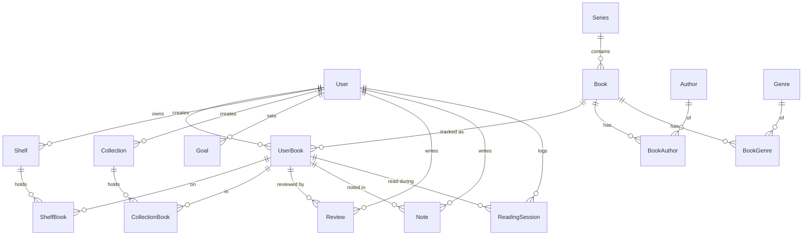

# Entity-Relationship Design — Book Tracker

_Owner: Agent 1. Source of truth is `prisma/schema.prisma`; this doc explains it._

## 1. Diagram

## 2. Entities

| Entity | Purpose | Key fields |
|--------|---------|-----------|
| **User** | Account (single local user now) | `email` (unique), `name` |
| **Book** | Shared, deduped catalog metadata | `title`, `isbn13` (unique), `pageCount`, `coverUrl`, `source`, `seriesId` |
| **Author** | Distinct author | `name` (unique) |
| **BookAuthor** | M:N book↔author with order | PK `(bookId, authorId)`, `order` |
| **Genre / BookGenre** | M:N book↔genre | `name` (unique) / PK `(bookId, genreId)` |
| **Series** | Book series | `name` (unique) |
| **UserBook** | A user's library entry (reading state) | `status`, `rating`, `favorite`, `currentPage`, `startDate`, `finishDate`; unique `(userId, bookId)` |
| **Shelf / ShelfBook** | Unlimited shelves, M:N to entries | `(userId, name)` unique |
| **Collection / CollectionBook** | Curated lists, M:N, ordered | `(userId, name)` unique |
| **Review** | Long-form review of an entry | `body` |
| **Note** | Private note, optional page anchor | `body`, `page` |
| **ReadingSession** | A logged reading sitting | `date`, `minutes`, `pagesRead`, `startPage`, `endPage` |
| **Goal** | Reading challenge | `type`, `target`, `year`, `metaKey/metaValue` |

## 3. Design rationale
- **Shared `Book` vs per-user `UserBook`.** Metadata is global and deduped by `isbn13`; reading
  state is personal. Prevents metadata duplication as the catalog scales to millions of rows.
- **No native enums / arrays.** SQLite supports neither. `status`, `source`, and goal `type`
  are constrained `String`s validated in app code; authors/genres are join tables. This keeps
  the schema identical when we move to Postgres (where we may later promote them to enums).
- **Cascade deletes.** Deleting a `User`/`Book`/`UserBook` cascades to dependent rows so there
  are no orphans. Deleting a library entry keeps the shared `Book` (other users may track it).

## 4. Index strategy
Defined in the schema:
- `UserBook(userId)`, `UserBook(userId, status)`, `UserBook(userId, favorite)` — the primary
  library list + filter paths.
- `UserBook(userId, bookId)` unique — prevents duplicate library entries.
- `Book.isbn13` unique, `Book.isbn10`, `Book.title`, `Book.seriesId` — lookups & dedupe.
- `Author.name` unique/index, join-table back-indexes (`authorId`, `genreId`, `userBookId`).
- `ReadingSession(userId, date)` — analytics time-series queries.

## 5. Scalability notes (target: 100k+ books/user, millions total)
- Every list query is `userId`-scoped and paginated — work is bounded by page size, not library size.
- ISBN dedupe keeps the `Book` table proportional to distinct titles, not user×book.
- For Postgres prod: add trigram/`pg_trgm` or full-text indexes for search; consider partial
  indexes per status; the current B-tree indexes already cover the common access paths.
- Heavy analytics can be precomputed/materialized later; reading sessions are pre-indexed by date.

## 6. Known limitations (this phase)
- SQLite `contains` search is LIKE-based (case-insensitive for ASCII, no relevance ranking).
  Acceptable for personal scale; Postgres full-text replaces it for production.
- No DB-level enforcement of enum values (enforced in app). Revisit when moving to Postgres.
